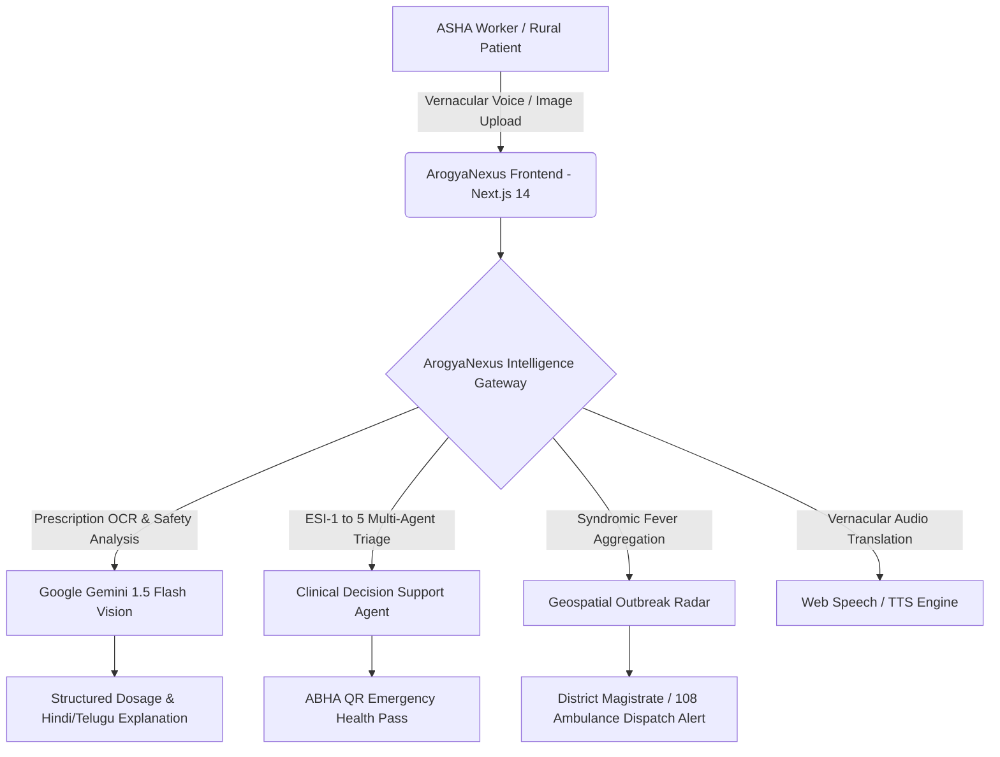

# 🩺 ArogyaNexus AI (आरोग्य नेक्सस)
### *Next-Gen Autonomous Public Healthcare & PHC Intelligence Platform*
**Built for Google Cloud & GDG "Build with AI: Code for Communities" Hackathon (Smart Health Track)**

[](https://vercel.com/new)
[](https://ai.google.dev/)
[](https://nextjs.org/)
[](https://opensource.org/licenses/MIT)

---

## 🌟 Executive Summary
Across India's 30,000+ Primary Health Centers (PHCs) and Community Health Centers (CHCs), frontline healthcare workers and rural doctors face overwhelming patient volumes, critical supply stockouts (such as anti-snake venom and oxygen cylinders), unreadable handwritten prescriptions, and sudden infectious disease surges (Dengue, Malaria, Cholera).

**ArogyaNexus AI** is an end-to-end, multi-agent AI ecosystem that transforms rural public healthcare delivery through:
1. **Google Gemini 1.5 Multimodal Vision**: Digitizes and explains messy doctor prescriptions and diagnostic lab reports with vernacular audio guidance.
2. **Autonomous Multi-Agent Clinical Triage Engine**: Computes real-time Emergency Severity Index (ESI 1–5) scores using vital signs & hemodynamics to instantly route critical emergencies (e.g. Myocardial Infarction, Dengue Shock) to life-saving interventions.
3. **Vernacular Voice Field Copilot for ASHA Workers**: Speech-to-Speech assistant in Hindi, Telugu, Tamil, and English for door-to-door triage and antenatal risk detection.
4. **Geospatial Outbreak Surveillance (IDSP Radar)**: Real-time GIS cluster heatmapping that detects localized disease outbreaks and alerts District Magistrates, CMOs, and Members of Parliament.
5. **Ayushman Bharat Digital Health (ABHA) QR Emergency Pass**: Generates verifiable digital passports for seamless rural-to-tertiary hospital transfers.

---

## 🏗️ Architecture & Technology Stack



### **Core Stack:**
- **AI Models**: Google Gemini 1.5 Flash (`@google/generative-ai`)
- **Web Framework**: Next.js 14 (App Router), React 18, TypeScript
- **Styling & UI**: Tailwind CSS, Lucide React, Glassmorphism Design System
- **State & Data Visualizations**: Recharts, Custom GIS Radar Visualizer
- **Deployment**: Vercel Edge Runtime / Serverless Functions

---

## 🚀 Key Modules & Capabilities

### 1. 🩺 Autonomous Multi-Agent Clinical Triage Queue (`/triage`)
- Computes Emergency Severity Index (**ESI-1 to ESI-5**) instantly from vital signs ($BP, SpO_2, Pulse, Temp$).
- Auto-generates stat resuscitation protocols (e.g. High-flow $O_2$, 12-lead ECG, IV fluid boluses).
- One-click ABHA digital emergency passport generation with QR code.

### 2. 📸 Gemini 1.5 Multimodal Prescription Scanner (`/vision-scanner`)
- Accepts photos or scans of handwritten prescriptions.
- Extracts active drug molecules, exact dosage, frequency (OD/BD/TDS), precautions, and dietary advice.
- Translates instructions into conversational vernacular audio for illiterate or non-English-speaking patients.

### 3. 🗺️ Geospatial Outbreak GIS Radar (`/outbreak-map`)
- Aggregates syndromic complaints to identify emerging Dengue, Cholera, and Malaria clusters.
- Predicts affected catchment population and dispatches Rapid Response Team (RRT) containment orders.

### 4. 🎙️ ASHA Vernacular Voice Copilot (`/asha-copilot`)
- Voice-first patient intake in Hindi, Telugu, Tamil, and English.
- Identifies maternal and pediatric red-flags and suggests immediate first-aid home care protocols.

### 5. 📦 PHC Supply, Bed & 108 Ambulance Dispatcher (`/phc-inventory`)
- Monitors real-time stock of Oxygen cylinders, Polyvalent Anti-Snake Venom, and IV fluids.
- Autonomous replenishment purchase orders triggered before stockouts occur.

---

## ⚡ Quick Start & Local Setup

```bash
# 1. Clone the repository
git clone https://github.com/mandhatisaiganesh/arogyanexus-ai.git
cd arogyanexus-ai

# 2. Install dependencies
npm install

# 3. Configure environment variables (Optional - built-in zero-friction demo mode included!)
cp .env.example .env.local
# Add your GEMINI_API_KEY from https://aistudio.google.com/

# 4. Launch development server
npm run dev

# 5. Open https://arogyanexus-ai.onrender.com/  in your browser
```

---

## 🌐 Deploy to Vercel

The application is pre-configured with `vercel.json` for one-click deployment on Vercel:

```bash
npx vercel
```

---

## 📄 License
Released under the [MIT License](LICENSE). Built with pride for Indian public health governance.
